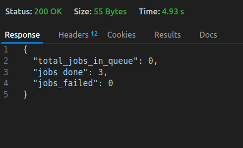

# WorkQueue

This is a Distributed Background Task Processing System written in Go and uses Redis for queuing the jobs.

## Whats the need of this?
    This is made to handle the processing and execution of background tasks concurrently to make the user experience better.
    Eg. A user needs to sign-in to your website and as soon as he clicks on that button, you need to send the user a welcome mail.
        If that task of sending a mail is a part of the Api call the user made, user will have to wait for a long time till the mail gets sent. We obviously don't want this.
        So instead of making the user wait, add the "send_email" task to WorkQueue and let it handle it's and all the other jobs execution for you.
    ** This is built to be modular in nature, any type of job can be added to it not just sending email , you just have to add the logic of that job as described at the end**

## Services

This repo provides two independent services.

### 1. Producer
    - Gives a ``` /enqueue ``` route to add your jobs/tasks.
    
#### How to add a job?
    - Send a http POST request to the exposed ``` /enqueue ``` route on this url [workqueue-producer](https://workqueue-producer.onrender.com/enqueue)
    - It accepts a task in this format (JSON)

        **Eg:- An inbuilt task the system supports as of now is to Send a Mail.Its JSON request would look like this**

        ```
        {
                "type":"send_email",
                "Retries": 3,
                "payload":{
                    "to":"worldisweird2020@gmail.comm",
                    "subject":"testing producer"
                }
        }
        ```
        **type** - REQUIRED. It tells the producer the type of job that is being added to the queue.
        **Retries** - Number of times the system should try to enqueue the job if it fails.
        **Payload** - Contains details about the task in key-value pair (Note that you can add any type/number of key value pair inside the payload, the backend is built to flexibly accept all types).


        This is the Go struct type it accepts.
        Here, the Payload is of type map[string]interface{} , giving it flexibility to have any number/type of key value pairs inside the payload.
    
        ``` 
            type Task struct {
                Type    string                 `json:"type"`
                Payload map[string]interface{} `json:"payload"`
                Retries int                    `json:"retries"`
            }
        ```
    
    This would response like this - 
    

### 2.Worker
    - Take the jobs out from the queue in a reliable manner and execute them.
    - Provides ``` /metrics ``` endpoint to view the stats.

#### How to View the status of your job? 
    Send a http GET request to [worker-url](https://workqueue-worker.onrender.com/metrics)
    This would give a response like this - 
    

    **total_jobs_in_queue** - Gives the number of jobs inside the redis queue at that moment.
    **jobs_done** - Total number of jobs executed till now.
    **jobs_failed** - Number of jobs failed to execute,if any.

## How are jobs getting executed?
    Inside the internal/worker/worker.go , you will find this function.
    Switch case makes it modular enough so you can add your job type just by adding another switch case.

    ** To add a new type of task - Just add it's function inside a new switch case, and thats it! **

    ```
    func Process_Task(task_to_execute task.Task) error {

	if task_to_execute.Payload == nil {
		return fmt.Errorf("payload is empty")
	}

	//Add your task type here , and perform the task under your switch case
	switch task_to_execute.Type {

	case "send_email":
		time.Sleep(2 * time.Second)
		fmt.Println("Sending email to ", task_to_execute.Payload["to"], " with subject ", task_to_execute.Payload["subject"])
		return nil
	case "resize_image":
		fmt.Println("Resizing image to x cordinate: ", task_to_execute.Payload["new_x"], " y cordinate: ", task_to_execute.Payload["new_y"])
		return nil
	case "generate_pdf":
		fmt.Println("Generating pdf...")
		return nil

	case "":
		return fmt.Errorf("task type is empty")
	default:
		return fmt.Errorf("unsupported task")

	}
}

    ```

## Additional features - 
    ** Concurrency ** is provided to enable fast execution using goroutines and sync package.

    ** Logging ** of each event is provided, and it gets stored inside the logs.txt file.
    This helps to traceback to success or failure of a job.
     Eg 
     


Created by - [Abhinav Jha](https://x.com/AbhinavXJ)